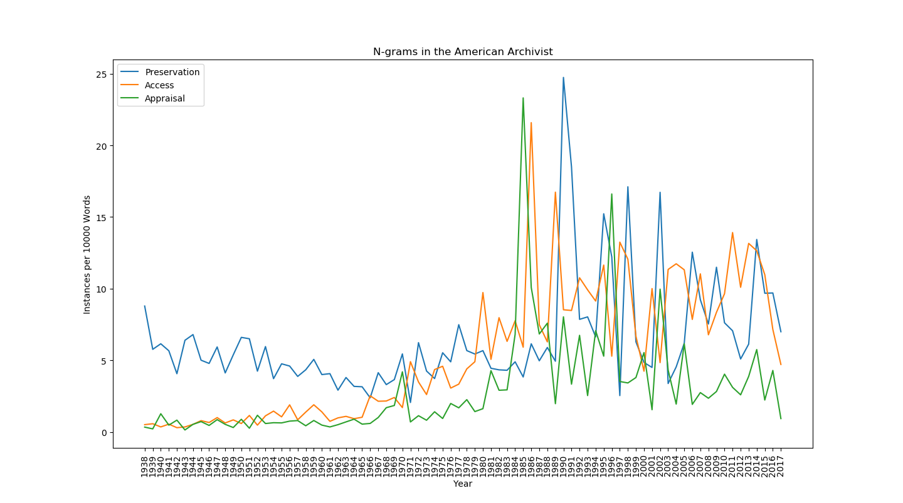
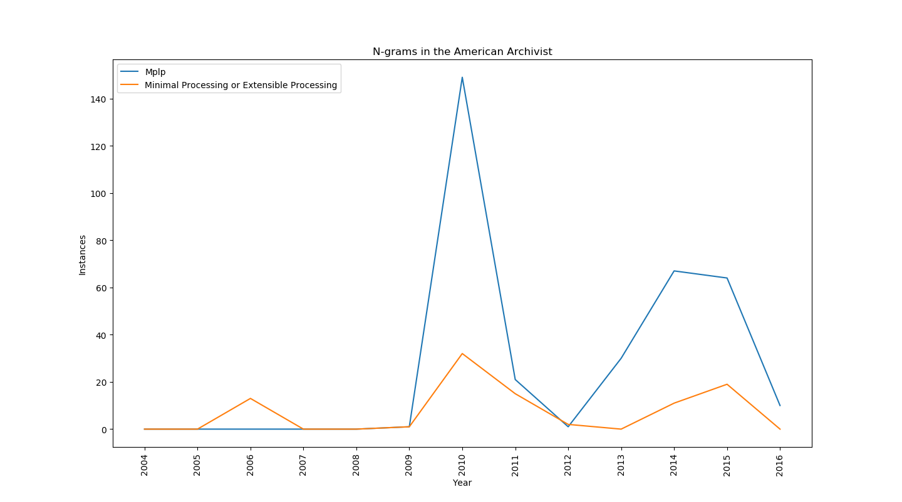
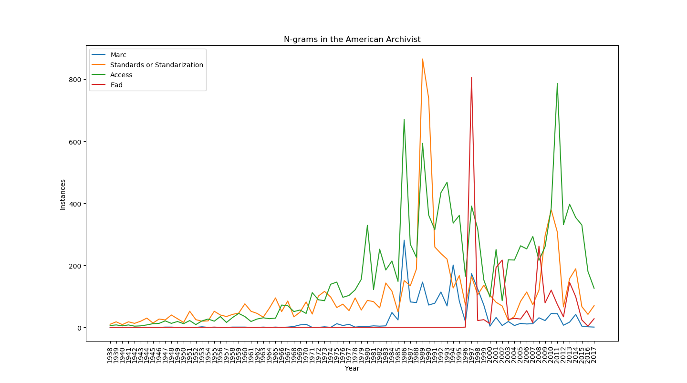
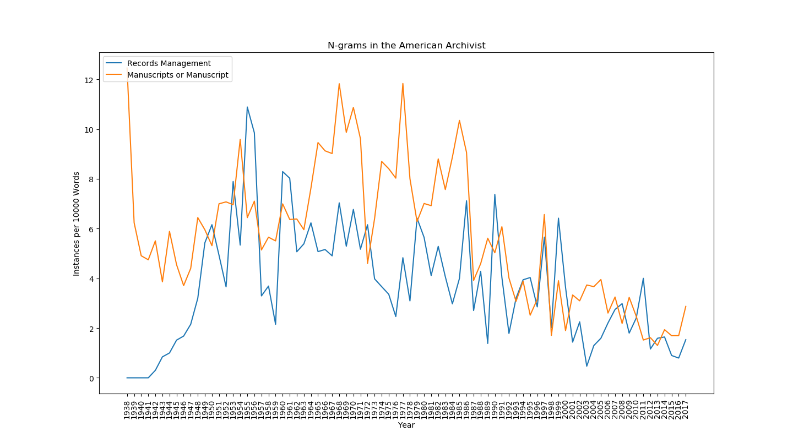

# aaText
Scripts for scraping and examining text from the American Archivist

## Quickstart

### Requirements

* Python 3 and pip
* ~15.7 GB+ of disk space
* High speed Internet connection to download PDFs
* Java to extract text

### Quickstart

1. `git clone https://github.com/gwiedeman/aaText`
2. `cd aaText`
3. `pip install -r requirements.txt`
4. `python scrapeAA.py` (will take significant time to download)
5. `python extractText.py`
6. `python graphAA.py -n "finding mediums|finding medium" -n "finding aids|finding aid"`

### Environments

* Tested on Windows and Ubuntu 16.04
* Ubuntu default Python 3 installs might not include tkinter
	* May require `apt-get install python3-tk` to run `graphAA.py`

## Downloading PDFs

* `scrapeAA.py` uses [`BeautifulSoup`](https://www.crummy.com/software/BeautifulSoup/ "BeautifulSoup") and [`requests`](http://docs.python-requests.org/en/master/ "requests") to Download all available PDFs from [http://americanarchivist.org/loi/AARC](http://americanarchivist.org/loi/AARC)
* This will take some time, and about 15.6 GB of disk space.
* 2,899 PDF files as of May 2018
* Creates `AmericanArchivst.csv` with year, volume, issue, type, authors, doi, url, and path to downloaded PDF
* The embargoed issues will not download unless you have IP access without having to log in

## TextExtraction

* `extractText.py` uses [tika](https://github.com/chrismattmann/tika-python) to grab all OCR and embedded text and save them to a `.txt` file for each issue in the `text` directory

## Graphing

* `graphAA.py` uses [nltk](https://www.nltk.org/) and [matplotlib](https://matplotlib.org/) to generate line graphs that you can save to `.png`
* Uses Bigrams, Trigrams, etc., so if you look for the phrase "Cataloguing is a function which is not working" then the script will look for `('cataloguing', 'is', 'a', 'function', 'which', 'is', 'not', 'working')` in that order among the tokenized text.
* Not case-sensitive, so "marc" will still find "MARC"

### Options

* `-n` flag for each word or phrase to graph
* Separate different versions with a pipe (|), such as `-n "finding aid|findingaids"`
* `-range` flag with date range as a limiter, such as `-range 1977-1991`
* `-per 1000`  graphs a ratio of instances per X number of total words
* `-x issues` Graphs individual issues instead of years
* `-input path\to\text` Takes a non-default directory for input text

### Samples

`python graphAA.py -n "preservation" -n "access" -n "appraisal" -per 10000`

`python graphAA.py -n "mplp" -n "minimal processing|extensible processing" -range 2004-2017`

`python graphAA.py -n "marc" -n "standards|standardization" -n "access" -n "EAD"`

`python graphAA.py -n "records management" -n "manuscripts|manuscript" -per 10000`

